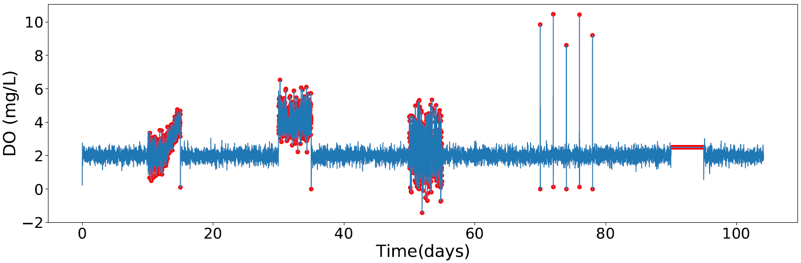
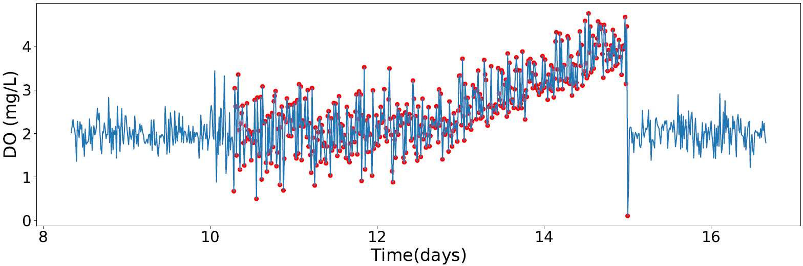

# Fault Detection in Wastewater Treatment Plants: Application of Autoencoders with Streaming Data
The objective of this work is to use Artificial Neural Networks (ANN), more specifically Autoencoders, to design a real time fault 
detection system for the dissolved oxygen (DO) sensor, present in the aeration system of the biological reactor of a 
wastewater treatment plant (WWTP).

## Table of Contents
* [General Information](#general-information)
* [Technologies Used](#technologies-used)
* [Results](#Results)
* [Setup](#setup)
* [Project Status](#project-status)
* [Room for Improvement](#room-for-improvement)
* [Acknowledgements](#acknowledgements)
* [Contact](#contact)
<!-- * [License](#license) -->

## General Information

- The work described here had its origin in the elaboration of the dissertation for the conclusion of the master's course in Data Science at the [Faculty of Sciences](https://sigarra.up.pt/fcup/pt/web_page.inicial) of the [University of Porto](https://www.up.pt/portal/pt/) - Portugal. The dissertation can be found [here](https://repositorio-aberto.up.pt/bitstream/10216/146754/2/597464.pdf). 

- This work originated a paper that was presented at the 7th Workshop on Data Science for Social Good - [SoGood 2022](https://sites.google.com/view/ecmlpkddsogood2022/home?pli=1), 19-23 September 2022, in Grenoble, France. This paper can be found [here](https://github.com/RodrigoSalles/WWTP_Fault_detection/blob/master/SoGood_2022.pdf).

- The objective of this work is to develop a real time fault detection system for the DO sensor of a WWTP biological reactor. 

- To better evaluate the performance of the Autoencoders three scenarios were considered with variations in the order of appearance, duration and intensity of failures.

- ANN models used for fault detection:
   * Convolutional Autoencoder
   * Long short term memory (LSTM)
   
- Faults implemented for autoencoder testing:
   * Drift 
   * Bias
   * Precision degradation
   * Spike
   * Stuck

## Technologies Used
- Python - version 3.8.8
- Keras - version 2.6.0
- TensorFlow - version 2.6.0
- Benchmark Simulation Model no. 2 (BSM2)

## Results
* Fault Detection Result Example - Convolutional Autoencoder

* Fault Detection Result Example - Convolutional Autoencoder - Drift fault.

## Setup
* The programs were developed in Python, with the help of Jupyter Notebook. The data used, with the implemented faults, were obtained through the BSM2 simulator implemented in Matlab/Simulink. 
* To obtain the dataset with the failures, for each of the scenarios, install the BSM2 simulator and run the model Matlab/Simulink "FCUP_BSM2". More information about the BSM2 simulator, its installation and operation can be found [here](https://github.com/wwtmodels) and [here](https://wwtmodels.pubpub.org).
* The datasets with implemented faults are in the Datasets folder.
* To get the fault detection results for the first scenario, according to the convolutional autoencoder, you should run the notebook "autoencoder_conv1". To get the results, in the same scenario, for the LSTM autoencoder you should run the notebook "autoencoder_lstm_1". For scenarios 2 and 3, you must run the notebooks indicated by the number in the name.
* When running the notebooks new models will be trained. To obtain the same results presented in the paper, you must use the trained models that are in the “models” folder.

## Project Status
The project was completed, and the results were presented in the aforementioned paper.

## Room for Improvement
* The use of other models of autoencoders can improve the results of the considered evaluation metrics.
* The combination of statistical methods with machine learning models can reduce the delay in detecting failures.

## Acknowledgements
* This research was supported by the ERDF and national funds through the project "PLATAFORMA DE ESTIMAÇÃO, CONTROLO E OTIMIZAÇÃO DE ESTAÇÕES DE TRATAMENTO DE ÁGUAS RESIDUAIS" - SYNAPPS (CENTRO-01-0247-FEDER-046978), and by Fundação para a Ciência e a Tecnologia (FCT) under the project UIDB/00048/2020.
* Institute of Systems and Robotic - [ISR](https://www.isr.uc.pt/). 
* DEEC - University of Coimbra - Portugal.
* Faculty of Sciences of the University of Porto - [FCUP](https://sigarra.up.pt/fcup/pt/web_page.inicial).

## Contact
Rodrigo Salles. Email: engenharia.salles@gmail.com 

...feel free to contact me!

<!-- Optional -->
<!-- ## License -->
<!-- This project is open source and available under the [... License](). -->

<!-- You don't have to include all sections - just the one's relevant to your project -->
